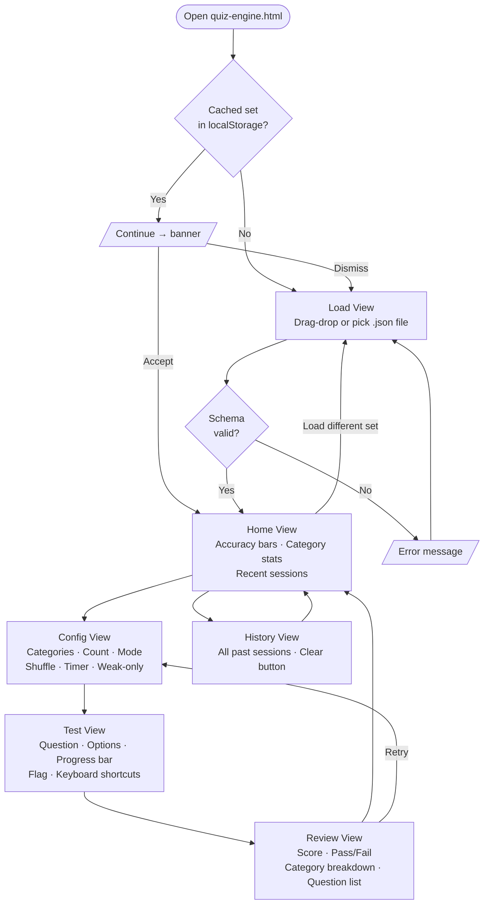
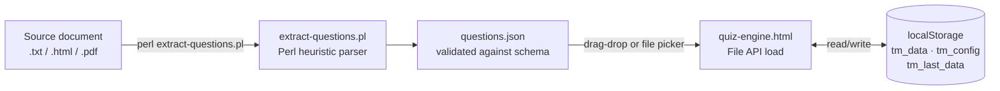

# DEV.md — Testmaker Developer Reference

Architecture, schema, design decisions, and extension guide.

---

## Project Architecture

Testmaker is intentionally dependency-free.

```
Testmaker/
├── engine/
│   └── quiz-engine.html       ← The entire app — one self-contained HTML file
├── parsers/
│   ├── extract-questions.pl   ← Free heuristic parser (text/HTML/PDF → JSON)
│   └── secplus-parser.pl      ← Reference parser (SecurityTester-specific, kept for reference)
├── schemas/
│   └── questions.schema.json  ← Formal JSON Schema (draft-07)
├── examples/
│   └── sample-questions.json  ← 10 demo questions
├── README.md                  ← User-facing docs
├── DEV.md                     ← This file
├── PLAN.md                    ← Phase plan and task tracking
└── CLAUDE.md                  ← AI session context
```

### quiz-engine.html

A single HTML file with all CSS and JavaScript inlined. No build step, no bundler, no npm. Open it directly with `file://` in any modern browser.

**App views (rendered via JS show/hide):**

| View | Description |
|------|-------------|
| `load` | Welcome screen — shown when no question set is loaded |
| `home` | Dashboard — accuracy bars, category breakdown, recent sessions |
| `config` | Test setup — category filter, count, mode, shuffle, timer |
| `test` | Active test — question display, answer selection, feedback |
| `review` | End-of-test results — score, category breakdown, question list |
| `history` | All past sessions |

### App view flow



### Data flow



**State:**
- Active question set lives in memory as `window.qs` (the parsed JSON object).
- All persistent data is stored in `localStorage` (see [localStorage schema](#localstorage-schema) below).
- The app is entirely stateless between page loads — it reconstructs state from localStorage on startup.

---

## questions.json Schema

### Full annotated example

```json
{
  "meta": {
    "name": "My Study Set",           // Required. Displayed in the app header.
    "description": "Optional blurb",  // Optional. Shown on the home screen.
    "version": "1.0",                 // Optional. For your own tracking.
    "author": "Jane Smith",           // Optional. Shown on the home screen.
    "examInfo": {                     // Optional. If absent, Exam Simulation is hidden.
      "questionCount": 90,            // Number of questions in an official exam.
      "timeMinutes": 90,              // Time limit in minutes.
      "passingPercent": 83            // Passing score (integer percent).
    },
    "categories": [                   // Required. At least one entry.
      {
        "id": 1,                      // Required. Must be an INTEGER (not "1").
        "name": "Category Name",      // Required. Displayed in filter and stat bars.
        "weight": 20                  // Optional. Exam simulation weighting (percent).
      }
    ]
  },
  "questions": [                      // Required. At least one entry.
    {
      "id": "cat1_q1",                // Required. Must be unique within the file.
      "category": 1,                  // Required. Must match a meta.categories[].id integer.
      "question": "Question text?",   // Required. Displayed as-is; basic HTML allowed.
      "options": {                    // Required. Keys are option labels (any strings).
        "A": "First option",
        "B": "Second option",
        "C": "Third option",
        "D": "Fourth option"
      },
      "correct": "B",                 // Required. Must exactly match a key in options.
      "explanation": "Why B is correct." // Optional. Shown after answering.
    }
  ]
}
```

### Field reference

| Field | Required | Type | Notes |
|-------|----------|------|-------|
| `meta.name` | ✅ | string | App header and localStorage key namespace |
| `meta.categories` | ✅ | array | Must have at least one entry |
| `meta.categories[].id` | ✅ | **integer** | Strict equality used throughout — must be `1` not `"1"` |
| `meta.categories[].name` | ✅ | string | Shown in category filter and stat bars |
| `meta.categories[].weight` | ⬜ | integer | Exam simulation % weighting; omit or use 0 for uniform distribution |
| `meta.description` | ⬜ | string | |
| `meta.version` | ⬜ | string | |
| `meta.author` | ⬜ | string | |
| `meta.examInfo` | ⬜ | object | If absent, Exam Simulation button does not appear |
| `meta.examInfo.questionCount` | ✅ (if examInfo) | integer | |
| `meta.examInfo.timeMinutes` | ✅ (if examInfo) | integer | |
| `meta.examInfo.passingPercent` | ✅ (if examInfo) | integer | 0–100 |
| `questions[].id` | ✅ | string | Must be unique within the file |
| `questions[].category` | ✅ | integer | Must match a `meta.categories[].id` |
| `questions[].question` | ✅ | string | |
| `questions[].options` | ✅ | object | Any key strings; any number of keys (2+) |
| `questions[].correct` | ✅ | string | Must exactly match a key in `options` |
| `questions[].explanation` | ⬜ | string | Shown after answering; nothing rendered if absent |

### Validation

The schema is formally defined in `schemas/questions.schema.json` (draft-07). The engine validates every loaded file client-side before accepting it. Validation errors are displayed to the user with the specific field that failed.

**Note:** JSON Schema draft-07 cannot enforce cross-field constraints (e.g., that `correct` matches a key in `options`). This constraint is checked by the engine's custom validator at load time, not by the schema file itself.

### Option key flexibility

Option keys can be any non-empty strings:

```json
// Standard multiple choice
"options": { "A": "...", "B": "...", "C": "...", "D": "..." }

// True/False
"options": { "True": "True", "False": "False" }

// Numbered
"options": { "1": "...", "2": "...", "3": "..." }
```

The `correct` field must exactly match one of the keys (case-sensitive).

---

## Building a Compatible Question Set Manually

1. Start with the annotated example above or copy `examples/sample-questions.json`.
2. **Category IDs must be integers.** Using string IDs (`"1"` instead of `1`) will silently break category filtering — questions won't appear in the right category.
3. **IDs must be unique.** Duplicate `id` values within a file will cause inconsistent behavior in history tracking.
4. **`correct` must exactly match a key in `options`.** The engine validates this at load time; if it fails, the question is rejected.
5. Validate with any JSON Schema validator (e.g., `jsonschema` CLI or an online tool) against `schemas/questions.schema.json` before loading.

---

## Running the Free Parser

`parsers/extract-questions.pl` converts structured `.txt`, `.html`, or `.pdf` documents into a valid `questions.json` file using regex heuristics and a line-by-line state machine.

### Requirements

- Perl 5.10+ (pre-installed on macOS/Linux; [Strawberry Perl](https://strawberryperl.com/) for Windows)
- CPAN module: `JSON` (`cpan JSON` or `cpanm JSON`)
- PDF support: `pdftotext` from Poppler on PATH (only needed for `.pdf` input)

### Usage

```bash
# Print to stdout
perl parsers/extract-questions.pl study-guide.txt

# Write to file
perl parsers/extract-questions.pl study-guide.txt -o questions.json

# With metadata overrides
perl parsers/extract-questions.pl study-guide.txt \
  -n "Network+ Exam Prep" -a "Jane Smith" -o network.json

# Show help
perl parsers/extract-questions.pl --help
```

### What the parser detects

| Pattern | Examples |
|---------|---------|
| Numbered questions | `1.`, `Q1.`, `Question 1:`, `1)` |
| Lettered options | `A.`, `A)`, `(A)`, `a.` |
| True/False questions | Any question with only True/False options |
| Inline answer keys | `Answer: B`, `Correct: C` |
| Separate answer key section | Block at end of document with `Answer Key` heading |
| Explanations | Lines starting with `Explanation:`, `Rationale:`, `Why:` |
| Category headings | `Chapter 3`, `Section:`, `##`, ALL-CAPS standalone lines |

### Review flags

Questions the parser is uncertain about are:
- Printed to **stderr** with a `[REVIEW]` prefix
- Marked in the output JSON with a `"_review": true` field (non-schema, for manual inspection)

Remove `_review` fields before loading in the engine, or they will trigger a schema validation warning.

---

## Known Limitations of the Free Parser

- **Irregular formatting fails silently.** If question boundaries can't be detected (e.g., no numbering), the parser may produce zero questions or merge multiple questions into one. Always verify output.
- **Separate answer key sections must come after all questions.** An answer key appearing mid-document will be partially or incorrectly detected.
- **Multi-column PDF layouts** break `pdftotext` line order, causing garbled output. Use the AI parser (Phase 6) for these.
- **Mixed question styles** (some numbered, some not) in the same file can confuse the state machine.
- **Explanations in options** — if a document prints explanation text inside the option block (before the next question), it may be incorrectly captured as an option.

---

## localStorage Schema

All data is scoped to the browser where the app runs.

### `tm_data_{encodedSetName}`

Per-question-set statistics. `encodedSetName` is `encodeURIComponent(meta.name)`.

```json
{
  "setName": "My Study Set",
  "sessions": [
    {
      "date": "2026-03-11T14:22:00Z",
      "score": 18,
      "total": 20,
      "categories": { "1": { "correct": 9, "total": 10 } }
    }
  ],
  "questions": {
    "cat1_q1": { "attempts": 5, "correct": 3 }
  }
}
```

### `tm_config`

Last used test configuration. Restored on the Config screen.

```json
{
  "lastFile": "my-questions.json",
  "categories": [1, 2],
  "count": 20,
  "mode": "immediate",
  "shuffle": true,
  "shuffleOptions": true,
  "weakOnly": false,
  "timer": false
}
```

### `tm_last_data`

Full cached question set JSON (best-effort; silently skipped on quota failure). Enables the "Continue →" banner without re-uploading the file. Write is wrapped in `try/catch` — if the browser quota is exceeded the app falls back to in-memory-only for that session.

---

## Key Design Decisions

| Decision | Choice | Reason |
|----------|--------|--------|
| Single HTML file | No build tooling, all inline | Zero dependencies, works from `file://`, trivially distributable |
| External JSON data | User loads their own file | Engine is publishable without copyright risk |
| File API (drag-drop + picker) | No server required | Works locally without any backend |
| Category IDs as integers | Strict equality (`===`) | Consistent type enforcement; string IDs silently break filtering |
| Option shuffling swaps values | Not key renaming | Keeps `correct` remapping simple; option labels stay stable |
| localStorage namespaced by set name | `tm_data_{encodedSetName}` | Supports multiple question sets without interference |

---

## Known Limitations

- **Renaming a question set orphans its history.** Stats are stored under `encodeURIComponent(meta.name)`. If you change `meta.name` in a JSON file, the app treats it as a new set. Old history remains under the previous key until browser data is cleared.
- **localStorage quota (~5–10 MB, browser-dependent).** Large question sets may not cache between sessions. The user will see the load screen again on next visit.
- **No cross-device sync.** History is local to the browser.
- **Exam simulation category weighting is not validated.** If category weights don't sum to 100, the engine uses proportional math — it won't error, but distribution may be unexpected.

---

## How to Extend

### Add a new app view

1. Add a `<div id="view-name" class="view hidden">` block in `quiz-engine.html`.
2. Add a `showView('view-name')` call where appropriate.
3. The `showView()` function hides all `.view` elements and shows the target.

### Support a new question field

1. Add the field to `schemas/questions.schema.json` (mark optional if not always present).
2. Update the client-side validator in the engine if the field has cross-field constraints.
3. Render it in the relevant view's HTML generation code.
4. Update `DEV.md` field reference table.

### Add a new parser input format

Add a branch in `load_file()` in `extract-questions.pl`. The function must return an array of plaintext lines for the state machine to process.

### Contribute

This project uses a PR-based workflow. One PR per logical change. See `CLAUDE.md` for the full git workflow and branch naming conventions.
